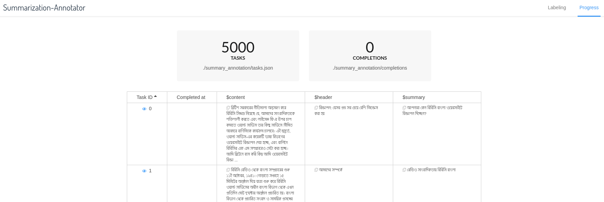
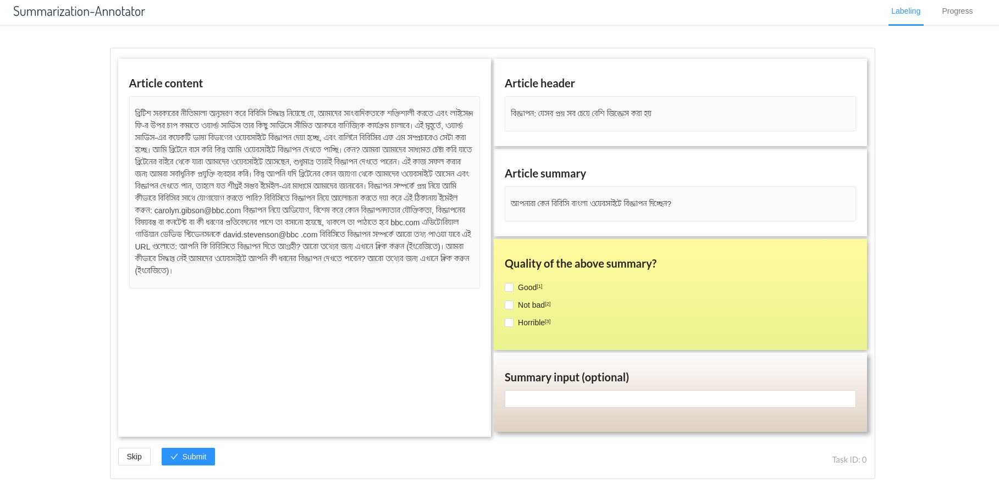

# Summary-annotator-gui

<br/>

 



## Setup

```bash
# installs required libraries and downloads raw data
chmod +x ./configure.sh && ./configure.sh
```
**For python 3.7, you may need to do ```pip uninstall typing``` if this script throws registry related errors.**

## Usage 

 
```bash
# This will open the gui in a tab of the default browser.
chmod +x ./run.sh && ./run.sh
```
